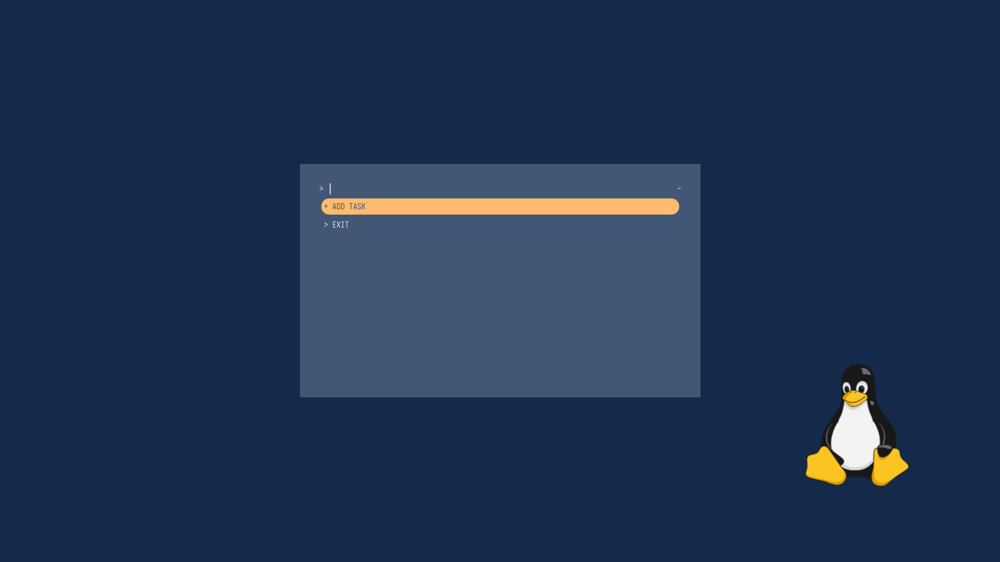
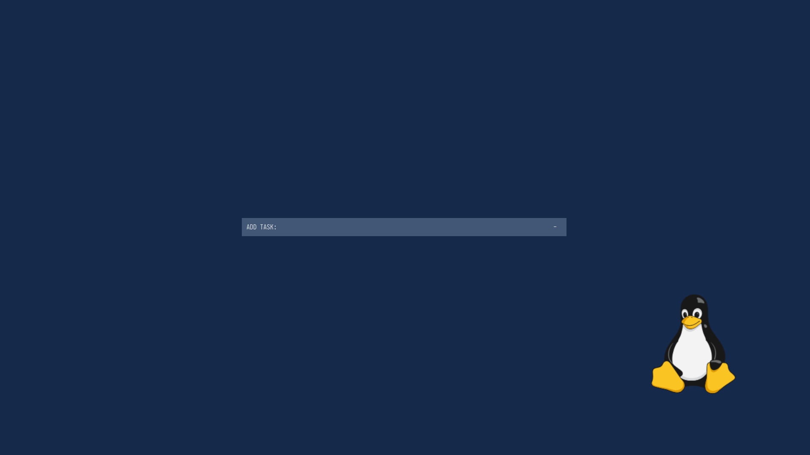

# todo-rofi
a simple todo list with rofi

# Installtion
First you need to install rofi from your package manager or use <a href="https://github.com/davatorium/rofi#themes">this !</a>
 and these steps

	1: git clone https://github.com/am-shm/todo-rofi.git
	2: cd todo-rofi
	3: chmod +x install.sh
	4: chmod +x rofi_todo.sh
	5: ./install.sh 

it will copy to your path with rofi_todo and you can run it from your application launcher or terminal.

# Screenshots
here some screenshots:

# Themes 
you can run <tt>sudo vim $(which todo_rofi)</tt> and edit the theme part to <b>windowed.rasi , full_screen.rasi </b>.
